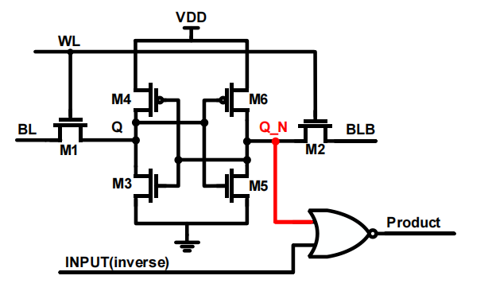

1. 模拟存算：crossbar电流累加，是RRAM/SRAM的天然用法
   输入电压(V) ──▶  [RRAM 阵列]  ──▶ 列电流 I = Σ V×G  ──▶ ADC ──▶ 数字输出
              (每个单元：电导 G 代表权重)

靠基尔霍夫电流定律在阵列内部免费完成乘加；输入需要DAC，输出需要ADC；精度受器件波动、噪声、ADC位数限制(通常int4~8)；
每个cell导通后会产生电流，这个电流可以在BL上进行累加，从而在BL上根据电流累加大小得出乘累加的数值；

2. 全数字存算，RRAM/SRAM只当数字权重存储器，计算全在数字域
   把权重存储在RRAM/SRAM中，在计算模式下，所有的WL全部打开，所以的存储cell全部导通，输出cell内部存储的“0/1”，这个输出作为数字逻辑单元（与/或/或非）的一个输入；
   另一个输入是输入数据，经过逻辑单元计算后输出两个bit的计算数值，后经过加法树，将这些部分和进行累加和移位就可以得到完整的多bit乘累加的效果；

3. 解决一个简单问题，计算模式下数据不经过SA，因为输出不是从BL/BLB上来的，而是直接在反馈的节点接出来的，这样可以看到SRAM存储节点内部的全摆幅电压，可以直接判定
   存储的是0还是1；具体的描述可见图1

  

4. 根据工作原理，灵敏放大器可以分为电压灵敏放大器和电流灵敏放大器；电压型对位线上的电压差进行放大，电流型对位线上的电流差进行放大；
